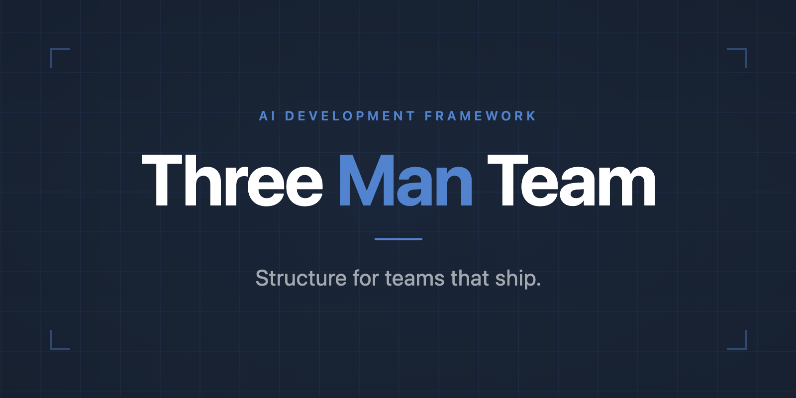
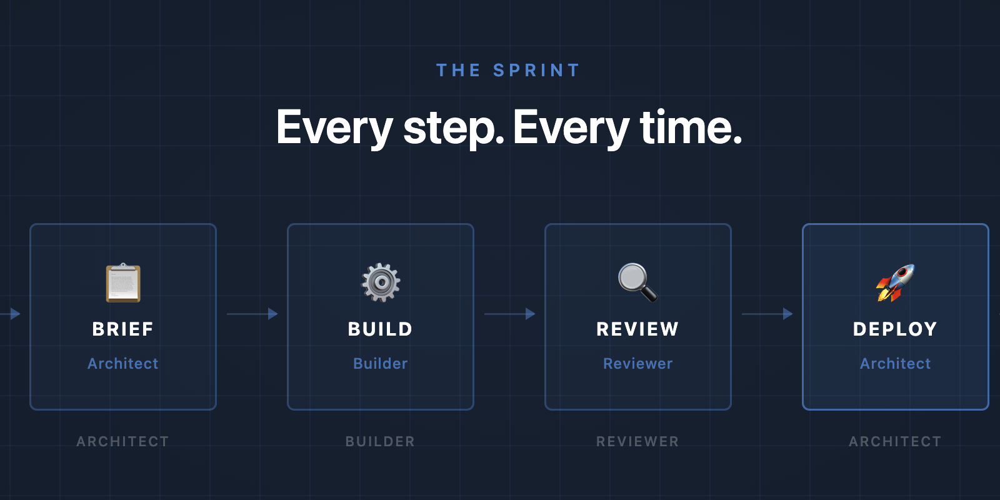
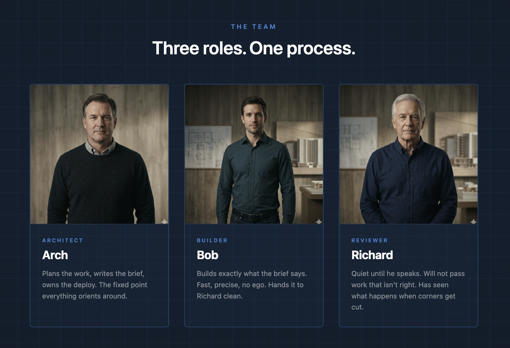

<p align="center">
  
</p>

<p align="center">
  <a href="https://russellenvy.github.io/three-man-team/">russellenvy.github.io/three-man-team</a>
</p>

---

## The Problem With AI Coding Tools

AI coding tools are powerful but undisciplined. They read entire codebases when they
need one function. They add features nobody asked for. They drift mid-task. They burn
tokens on every session doing work that didn't need to happen.

The solution isn't a better prompt. It's a process.

Three Man Team gives you three agents with distinct jobs, clear handoffs, and rules that prevent the most expensive failure modes. The Architect plans and deploys. The Builder builds exactly what the brief says. The Reviewer doesn't pass work that isn't right.

---

## Why Three Agents

DeepMind's multi-agent research shows teams of 3-5 with structured artifact handoffs
outperform both solo agents and larger groups. Three is not arbitrary — it is the
minimum for meaningful review and the maximum before coordination overhead eats the gain.

The roles map to how real software ships:
- Someone who understands the whole system and owns the deploy
- Someone who builds fast and clean
- Someone who catches what the builder missed

---

## Quick Start

Choose your install type:

---

### Per-project install (recommended)

One project, one install. Clone directly into your project folder.

**Step 1 — Navigate to your project folder and clone**

```bash
git clone https://github.com/russelleNVy/three-man-team.git .claude/skills/three-man-team
```

**Step 2 — Run setup and follow the instructions**

```bash
cd .claude/skills/three-man-team && ./setup
```

Setup takes over from here. It will give you the exact commands to run and the prompt to paste into Claude to get started. Follow what it prints.

---

### Global install (all projects)

Install once, use in any project.

**Step 1 — Clone to your global Claude skills folder**

```bash
git clone https://github.com/russelleNVy/three-man-team.git ~/.claude/skills/three-man-team
cd ~/.claude/skills/three-man-team && ./setup
```

That's the one-time install. Setup will confirm everything is in place.

---

**For each project you want to use Three Man Team on:**

**Step 2 — Copy agent files into your project, then spin up Claude**

```bash
cp -r ~/.claude/skills/three-man-team/templates/project-folder/* /path/to/your/project/
cd /path/to/your/project
```

Open Claude Code and paste:

```
You are the Architect on this project. Please read new-setup.md.
```

Arch will handle the rest — project context file, team names, and your first session prompt.

---

## The Workflow

<p align="center">
  
</p>

Every unit of work follows the same path. Architect plans and writes the brief. Builder reads it, shows a plan, builds, and hands off to Reviewer. Reviewer clears it or sends it back. Architect deploys with the Project Owner's go-ahead. Nothing skips a step.

See a complete example from problem to deploy → [`examples/sprint-walkthrough.md`](examples/sprint-walkthrough.md)

---

## The Team

<p align="center">
  
</p>

Three agents. Three distinct jobs. Built to work together.

Architect, Builder, Reviewer are the defaults. Rename them to anything — Arch will handle it during setup.

---

## Token Optimization

Every session starts with five rules baked into CLAUDE.md:

```
Is this in a skill or memory?   → Trust it. Skip the file read.
Is this speculative?            → Kill the tool call.
Can calls run in parallel?      → Parallelize them.
Output > 20 lines you won't use → Route to subagent.
About to restate what user said → Delete it.
```

Install your `token-optimizer` skill globally at `~/.claude/skills/token-optimizer` or
reference it from your project's `.claude/skills/` directory.

For bash output compression on top of these rules, see [RTK](https://github.com/rtk-ai/rtk) —
a separate tool that compresses `find`, `ls`, `grep` output before it reaches Claude's context.
Not required, but recommended for heavy Claude Code CLI users. The combination of RTK (bash layer)
+ token-optimizer (behavior layer) is where real savings compound.

See `docs/token-optimization.md` for the full discipline.

---

## Templates

- `templates/project-folder/` — **Start here.** Named personas (Arch, Bob, Richard), fully written and ready to use. Customize the Who You Are sections and rename to fit your team.
- `templates/generic/` — Blank slate with `[CUSTOMIZE]` placeholders. Use this if you want to build your own personas from scratch or install globally across all projects.

Arch handles renaming during setup — just tell it the new names.

---

## License

MIT. Free forever.

---

## Built By

Russell Aaron — 20+ years building and supporting software the right way. He built this team
in production shipping a real SaaS platform. It works because it was used before it was
published, fine tuned, and will continue to get better over time as AI models and tools evolve.
